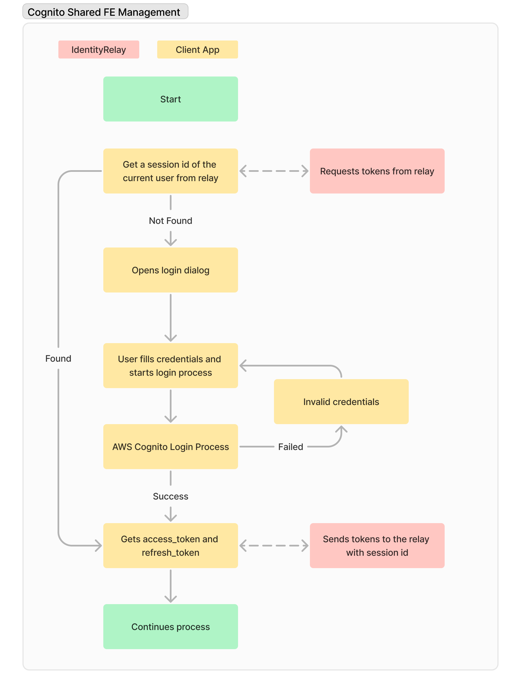

# CognitoTests Projects

This POC contains 3 seperate example projects and 1 main hub that demonstrate how to use AWS Cognito for user authentication. This approach is used just for demonstration purposes and should not be used in production.

## Projects
# 1. IdentityRelay
This is basic project just gets window.message objecs saves them to local storage and then redirects to the client apps which they contain the relay in iframe.

# 2. React Full
This is a full react app that uses the AWS Amplify library to authenticate users and then display the user's information.
> Note: This is the only project that the user able to log-in and log-out.

# 3. React Mini
This is a mini react app that uses the identity relay to see tokens and then display the user's information if the user logged-in.

# 4. Simple Page
This is a simple html page that uses the identity relay to see tokens and then display the user's information if the user logged-in. Created for legacy web applications such as ASP.NET MVC / WebForms, PHP, etc.

